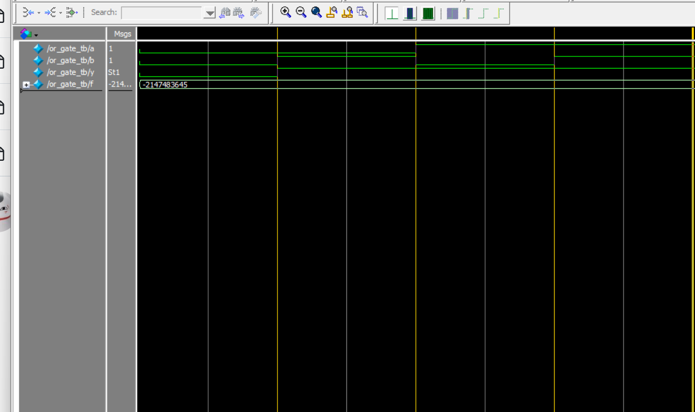

# OR Gate Simulation – Verilog + ModelSim

這是一個使用 Verilog 設計並模擬 2-input OR Gate 的小專案。使用 ModelSim 進行模擬，輸出結果會記錄在 `monitor_log.txt`。

---

## 📁 檔案說明

| 檔案名稱         | 說明                                |
|------------------|-------------------------------------|
| `or_gate.v`      | OR Gate 的 Verilog 模組程式          |
| `or_gate_tb.v`   | 測試平台（Testbench）程式             |
| `monitor_log.txt`| 模擬輸出結果的紀錄（由 `$fwrite` 寫入） |
| `or_gate.vcd`    | 模擬產生的 VCD 波形檔，可用於 ModelSim 波形顯示|

---

## ✅ 模擬方法

### 使用 ModelSim 指令：

```tcl
vlib work
vlog or_gate.v or_gate_tb.v
vsim work.or_gate_tb
run -all
```
模擬結束後，會在同資料夾中產生 monitor_log.txt，記錄模擬過程中 OR gate 的輸入與輸出變化。

🧪 模擬輸出結果範例
a=0, b=0, y=0 @ 10000 ns
a=0, b=1, y=1 @ 20000 ns
a=1, b=0, y=1 @ 30000 ns
a=1, b=1, y=1 @ 40000 ns



📌 備註
*使用 $fwrite 寫入模擬輸出，而非純粹用 $display
*使用 ModelSim - Intel FPGA Edition 10.5b 測試
*沒有使用 FPGA 實體燒錄，僅模擬環境

🛠️ 適合初學者理解 Verilog 基本邏輯與模擬流程。